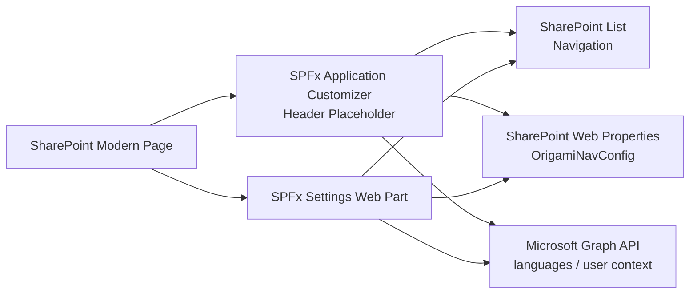

# Architecture

## Overview

The solution is composed of two SPFx artifacts that share a common data model. The Application Customizer renders the runtime navigation into the modern page header placeholder, while the Settings Web Part gives administrators a managed UI to configure appearance, layout, targeting, and data source behavior. Navigation content is stored in a SharePoint list named `Navigation`, visual settings are stored in the web property bag, and selected runtime features use SharePoint REST and Microsoft Graph APIs.

## Overview Diagram



## Component Tree

```text
TopNavigationApplicationCustomizer
└── TopNav
    ├── NavFolder (×n)
    │   └── DropdownMenu
    │       └── NavItem (×n)
    ├── Breadcrumb
    └── LanguagePicker

NavSettingsWebPart
└── NavSettingsApp
    ├── NavSettingsPanel
    │   └── ThemeEditor
    └── NavItemManager
        ├── FolderRow (×n)
        │   └── ItemRow (×n)
        └── PermissionEditor
```

## Data Flow

### 1. Navigation Data Load and Render

1. The Application Customizer initializes on a modern page and requests the Header placeholder.
2. `useNavData` reads the `Navigation` list from the current site or from `sourceUrl` when cross-site mode is enabled.
3. The hook normalizes folders and items into the shared `NavFolder` and `NavItem` types.
4. `useCurrentUser` resolves the current user's SharePoint groups.
5. `useNavFilter` removes folders and items that the user is not allowed to see.
6. The filtered result is rendered by `TopNav`, `NavFolder`, `DropdownMenu`, `Breadcrumb`, and `LanguagePicker`.

### 2. Admin Settings Change and Re-Render

1. An administrator opens the Settings Web Part and edits a visual or behavior setting.
2. `saveConfig` serializes the `NavConfig` object and writes it to the web property bag key `OrigamiNavConfig`.
3. The Settings Web Part refreshes its local preview state immediately after a successful save.
4. On the next page load, or after an explicit refresh message/event, the Application Customizer reloads config and re-renders using the updated values.

### 3. Permission Check and Visibility Filtering

1. The current user context is loaded with SharePoint REST through PnPjs.
2. Group login names are passed into `useNavFilter`.
3. Each folder and item is compared against its `allowedGroups` array.
4. Matching items are rendered; non-matching items are omitted entirely so no empty layout gaps remain.

## Design Decisions

### Why Application Customizer Over Web Part for Nav Rendering

The navigation must appear consistently across modern pages without requiring authors to place a component on every page. The Application Customizer attaches to the page chrome and is the correct SPFx primitive for tenant-wide or site-wide navigation.

### Why Web Properties for Config Storage

Visual configuration is site-scoped metadata rather than content. Storing it in the property bag avoids mixing singleton configuration with list rows, reduces list schema complexity, and supports a simple read-on-load pattern for the customizer.

### Why PnPjs v3 Over Raw `fetch`

PnPjs abstracts SharePoint REST details, form digest handling, batching, retries, and SPFx context wiring. That lowers implementation risk and keeps data access code consistent across the extension and the Settings Web Part.

### Why CSS Injection for Hiding SharePoint Navigation

The requirement is to reversibly suppress built-in SharePoint chrome. CSS injection is less brittle than DOM mutation because it avoids moving or removing SharePoint-owned nodes and can be cleanly turned on or off through a single style block.
